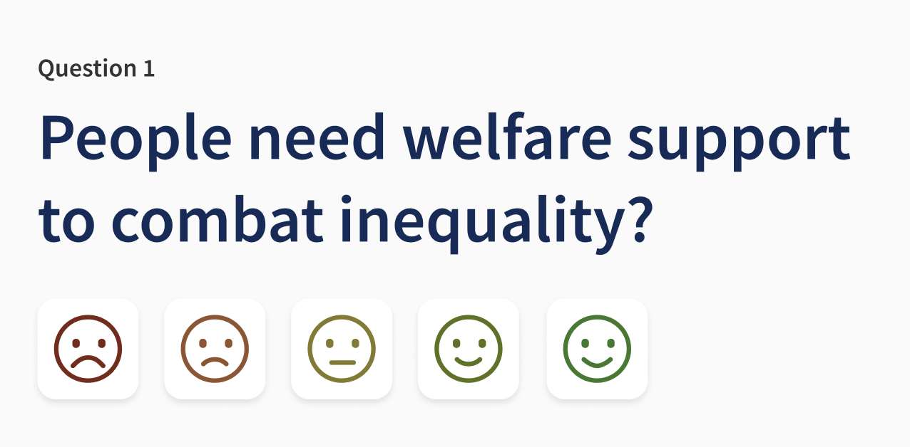
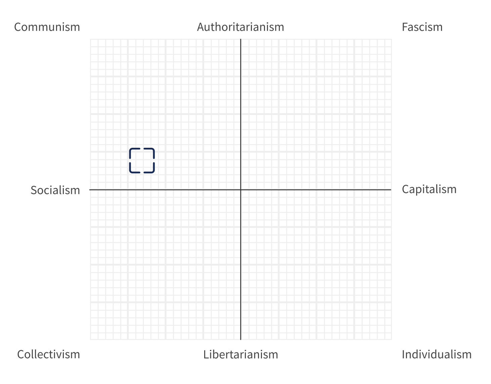

# political-compass

Quiz using Economic and Social questions to score answers and plot results on a chart of political ideologies.

## Questions

Based on the Political spectrum article:
https://en.wikipedia.org/wiki/Political_spectrum

- People need welfare support to combat inequality (believes in Economic Equality)
- Companies need regulating by the government (believes in Economic Equality)
- Freedom of big business is better for the economy (believes in Economic Hierachy)
- Wages are always fair, as companies will match market rates (believes in Economic Hierachy)
- Government may spy on citizens to combat terrorism (believes in State Rule)
- Government must project strength to succeed (believes in State Rule)
- Government should be less involved in the day to day life of its citizens (believes in Individual Rule)
- The smaller the government, the freer the people (believes in Individual Rule)

## Answers

Based on the Likert scale:
https://en.wikipedia.org/wiki/Likert_scale

- Strongly disagree
- Disagree
- Neither agree nor disagree
- Agree
- Strongly agree

## Ideologies

Based on the political ideologies article:
https://en.wikipedia.org/wiki/List_of_political_ideologies

- Communism (believes in State Rule and Economic Equality)
- Authoritarianism (believes in State Rule)
- Fascism (believes in State Rule and Economic Hierachy)
- Socialism (believes in Economic Equality)
- Centerism
- Capitalism (believes in Economic Hierachy)
- Collectivism (believes in Individual Rule and Economic Equality)
- Libertarianism (believes in Individual Rule)
- Individualism (believes in Individual Rule and Economic Hierachy)

## Directory structure

    /                                  --> Project root
    /src                               --> Source files

## Contact

For more information please contact kmturley
